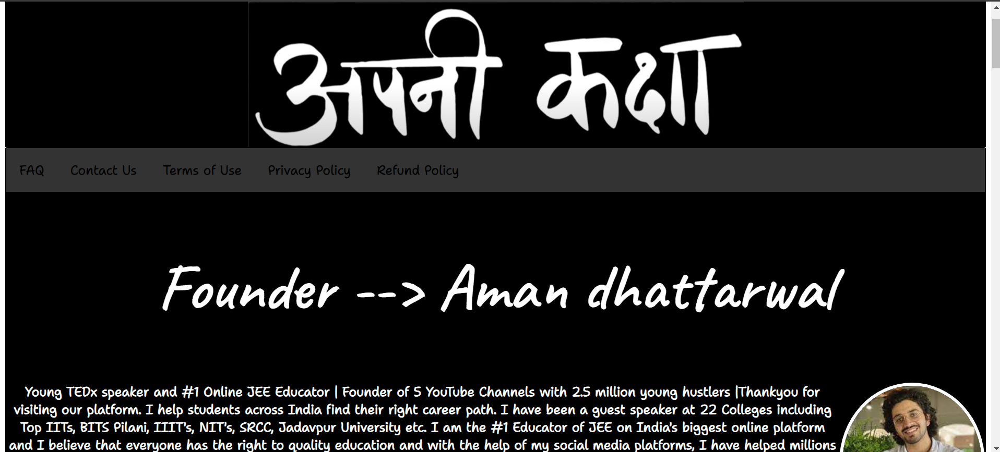

# Apni Kaksha
Welcome to the one of the finest edtech platforms of India "Apni Kaksha"


## Details about the project
<ul>
  <li>Responsive Web Design</li>
  <li>List of the youtube channels and other entities</li>
  <li>Drive Links of notes of important topics</li>
  <li>Details about the premium courses.</li>
</ul>

## Technologies Used
<ul>
  <li>HTML</li>
  <li>CSS</li>
  <li>Javascript</li>
</ul> 

## Getting Started
1. Clone the Repository
```sh
https://github.com/Abhirajtiwari1/oasistask-landingpage.git
```
2.  Access the index.html
```sh
open index.html
```

## Contribution
Contributions are welcomed in the project:

1. Fork the Repository

2. Create a new feature:
```sh
git checkout -b feature/YourFeature
```

3. Commit Your Changes:
```sh
git commit -m 'Add some feature'
```

4. Push to the branch:
```sh
git push origin feature/YourFeature
```

5. Open a pull request
